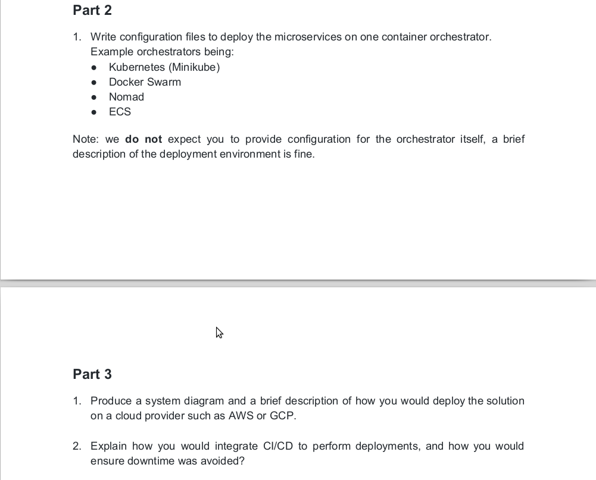
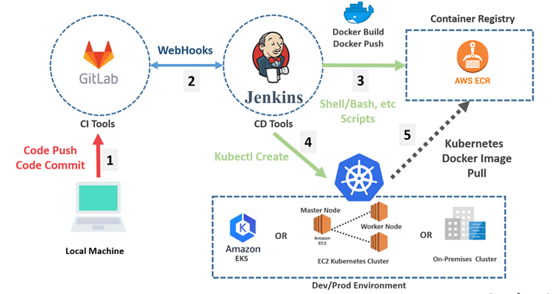

# 1. Overview
This is simple nodejs based application designed to showcase microservices in kubernetes. Application contains two REST api services to provide a JSON response over HTTP.

# 2. Environment
Document describes environment used in this showcase.
> [Environment](docs/Environment/README.md)

## 3. Repository Structure
The main levels of the repository directory tree are laid out as follows 
```
.
├── services            
│   └── service-1           NodeJS /api service
|   └── service-2           NodeJS internal /reverse service
├── docs                    Documentation
├── kubernetes              Kubernetes installation scripts to setup application to kubernetes.
├── docker-compose.yml      Docker compose to setup application to docker.
```

# 4. PART-1


## 4.1 Docker hosted application (For local development only)
Simplyfied overal structure of application networking.


## 4.2 Docker application quick launch (For local development only)
Document uses ubuntu terminal to show docker image build and started service for quick application testing. Finally starts containers in local docker service and has some curl based test cases.
> [Docker application quick launch](docs/DockerApplicationQuickLaunch/README.md)

# 5. PART-2 & PART-3


## 5.1 Kubernetes hosted application
Simplyfied overal structure of application networking.


## 5.2 Kubernetes application quick launch
Document uses Ubuntu terminal to show docker image build and to deploy them to local kubernetes cluster. Follw the instructions mentioned to deploy and test application in kubernetes cluster.
> [Kubernetes application quick launch](docs/KubernetesApplicationQuickLaunch/README.md)

## 5.3 Deploy application in EKS

Things need to consider for production deployment.
1. Terrafrom Iac should be used instead of k8s manifest file for EKS cluster and application stack deployment.
2. ECR should be used to store docker images.
3. Packer can be used to build docker image and to push the image in AWS ECR.
5. Ansible can be used install required software in docker image using ansible provisioner.
6. For backups and restores, use Velero and store backups in Amazon S3 Buckets that are protected against deletion, and enable versioning and encryption.
7. Use Hashicorp consul and vault for configuration and secrets management.
8. ExternalDNS to add dynamic DNS resource records.
9. IRSA - Provide AWS IAM roles for pods running on K8s.
10. Implement security features such as Pod Security Policy (PSP) and Open Policy Agent (OPA).
11. Prometheus and Grafana can be installed in EKS cluster for monitoring using helm chart.
4. Jenkins or other CI/CD tools should be used to build docker image and deploy it in EKS kubernetes cluster.

NOTE: Isto can be used as service-mesh as it provides many features like circuit-breaker, mtls, fault-injection, canary deployment etc

How to avoid downtime ?
Many strategy'scan be followed to avoid outage like:
1. Configuration of pod autoscalar
2. Configuration of cluster autoscaler using helm charts
3. Monitoring of EKS cluster using different tools like dynatrace etc
4. Blue-Green deployment strategy to avoid outage.


