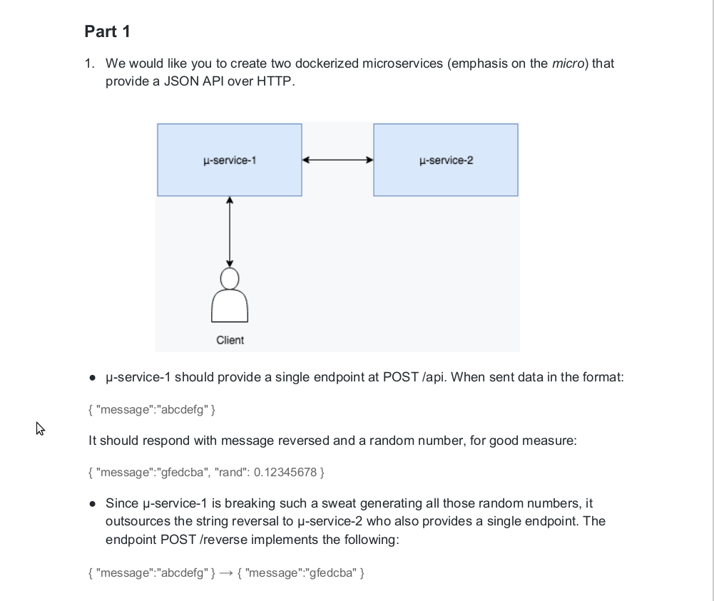
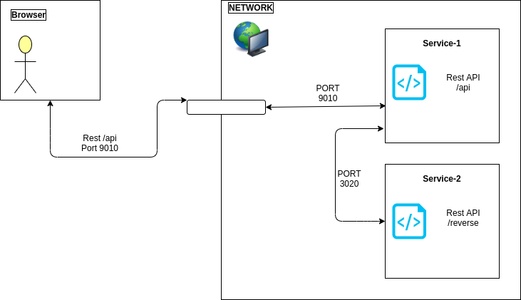
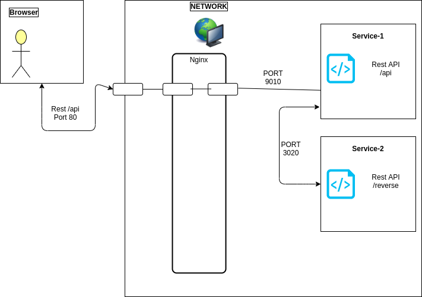

# Overview
This is simple nodejs based application designed to showcase microservices in kubernetes. Application contains two REST api services to provide a JSON response over HTTP.

PART-1


## Docker hosted application (For local development only)
Simplyfied overal structure of application networking.


## Kubernetes hosted application
Simplyfied overal structure of application networking.



# Repository Structure
The main levels of the repository directory tree are laid out as follows 
```
.
├── services            
│   └── service-1           NodeJS /api service
|   └── service-2           NodeJS internal /reverse service
├── docs                    Documentation
├── kubernetes              Kubernetes installation scripts to setup application to kubernetes.
├── docker-compose.yml      Docker compose to setup application to docker.
```


# Environment
Document describes environment used in this showcase.
> [Environment](docs/Environment/README.md)


# Docker application quick launch (For local development only)
Document uses ubuntu terminal to show docker image build and started service for quick application testing. Finally starts containers in local docker service and has some curl based test cases.
> [Docker application quick launch](docs/DockerApplicationQuickLaunch/README.md)


# Kubernetes application quick launch
Document uses Ubuntu terminal to show docker image build and to deploy them to local kubernetes cluster. Follw the instructions mentioned to deploy and test application in kubernetes cluster.
> [Kubernetes application quick launch](docs/KubernetesApplicationQuickLaunch/README.md)


